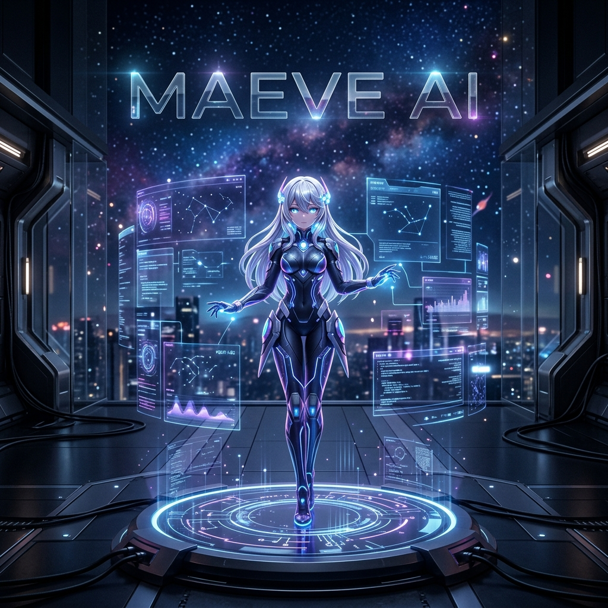

# 🌌 Maeve AI: The Future of Interactive 3D Assistance



[](https://vitejs.dev/)
[](https://reactjs.org/)
[](https://threejs.org/)
[](https://www.typescriptlang.org/)

**Maeve AI** is a state-of-the-art, immersive 3D AI assistant platform. Built with a "World-class 3D HUD" philosophy, it combines high-fidelity VRM character rendering, real-time speech recognition, and a dynamic interaction system to create a truly responsive digital companion.

---

## ✨ Key Features

- **🎭 High-Fidelity VRM Integration**: Supports full VRM character models with spring-bone physics, facial expressions, and high-quality textures.
- **🗣️ Real-time Lip-Sync & Speech**: Integrated speech recognition and procedural lip-syncing for realistic conversations.
- **🕹️ Immersive 3D HUD**: A premium, responsive interface featuring modules for Care, Wellness, Device Management, and Scheduling.
- **🎵 Spotify Neural Link**: Seamlessly connect and control your Spotify playback with real-time mood-based interactions.
- **🌌 Dynamic Environments**: Fully customizable 3D environments with starry backgrounds and reactive lighting.
- **🧠 Advanced State Management**: Powered by Zustand and Firebase for lightning-fast responsiveness and data persistence.

---

## 🛠️ How the System Works

Maeve AI is built on a modern, distributed architecture designed for low-latency interactions and high visual quality.

### 1. Rendering Engine (Frontend)
The core of Maeve is built using **React 19** and **Three.js** (via **React Three Fiber**). This allows for a declarative 3D scene where the character and UI coexist in a unified space.
- **VRM Controller**: Uses `@pixiv/three-vrm` to handle character animations, gaze tracking (following your mouse), and blend-shape expressions.
- **HUD Layer**: A high-performance overlay built with **Tailwind CSS** and **Framer Motion** for smooth transitions and glassmorphism effects.

### 2. AI Intelligence (Backend)
The brain of Maeve is a high-performance Python backend that handles complex AI tasks.
- **Vision & Emotion**: Integrated vision services for real-time environment awareness and emotion detection.
- **Neural TTS**: Sophisticated Text-to-Speech engine using Kokoro and ONNX for natural, expressive voice synthesis.
- **Proactive Initiative**: An autonomous engine that allows Maeve to take initiative and start conversations based on user context.

### 3. Interaction & Logic
- **Socket Bridge**: A WebSocket-based worker bridge handles real-time data flow between the AI brain and the 3D representation.
- **Mood System**: A sophisticated state machine that tracks Maeve's "mood," influencing her animations, speech patterns, and even the UI vibe.
- **Neural Links**: Direct integrations with services like Spotify to create a holistic assistant experience.

---

## 💻 Getting Started (PC)

Follow these steps to get Maeve AI running on your local machine.

### Prerequisites
- [Node.js](https://nodejs.org/) (v18 or higher recommended)
- [npm](https://www.npmjs.com/) or [yarn](https://yarnpkg.com/)

### Installation

1. **Clone the repository:**
   ```bash
   git clone https://github.com/binoremohapatra/Maeve-AI.git
   cd mavepai
   ```

2. **Install dependencies:**
   ```bash
   npm install
   ```

3. **Set up Environment Variables:**
   - Copy `.env.example` to `.env`
   - Fill in your Firebase and API credentials.
   ```bash
   cp .env.example .env
   ```

4. **Launch the Development Server:**
   ```bash
   npm run dev
   ```

5. **Open in Browser:**
   - Navigate to `http://localhost:5173` (or the port shown in your terminal).

---

## 🎮 Basic Interactions

- **Mouse Movement**: Maeve's eyes and head will track your cursor in real-time.
- **Radial Menu**: Use the central dock to navigate between different HUD modules (Settings, Wellness, etc.).
- **Voice Commands**: Click the microphone icon or use the wake-word (if configured) to speak to Maeve.
- **Chat Input**: Type commands directly in the expandable chat bar for instant feedback.

---

## 🏗️ Project Structure

```text
mavepai/
├── public/          # Static assets (3D models, textures, banner)
├── src/
│   ├── components/  # React components (VRMScene, HUD, etc.)
│   ├── stores/      # State management (Zustand)
│   ├── vibe/        # Visual effects and themes
│   ├── hooks/       # Custom React hooks
│   └── App.tsx      # Main application entry
├── package.json     # Project dependencies and scripts
└── vite.config.js   # Vite configuration
```

---

> [!NOTE]
> This project is currently in active development. Features and UI components are subject to change.

> [!IMPORTANT]
> **Safety & Content**: Some modules may contain mature themes. User discretion is advised.

---

*Built with ❤️ by the Maeve AI Team.*
